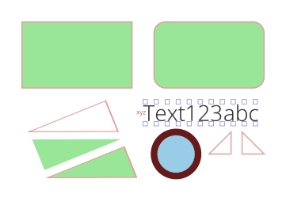

DRAW
====

I started work on a package to create [Sudoku diagrams](https://github.com/nklein/sudoku-diagrams).
I know that sometimes I want them in a printable version and other times I want them
in a format that is easily displayed on the web.

This package attempts to distill the common parts of `CL-PDF`, `Vecto`, and maybe someday `CL-SVG`
into one interface where I can swap out the back-end to generate the type of file that I need
at a given time.

To render the Sudoku diagrams as PDFs, I used these functions from `CL-PDF`:
`bounds`, `circle`, `close-and-fill`,
`close-and-stroke`, `close-fill-and-stroke`, `draw-text`,
`get-char-size`, `get-font`, `get-font-descender`,
`get-kerning`, `in-text-mode`, `line-to`,
`move-text`, `move-to`, `rectangle`,
`set-font`, `set-line-width`, `set-rgb-fill`,
`set-rgb-stroke`, `translate`, `with-document`,
`with-page`, `with-saved-state`, `write-document`

With the exception of the `with-page` macro, these all seem very do-able
with `Vecto` (with some help from `ZPB-TTF`).
These are probably all very do-able in `CL-SVG`, as well, (though maybe not
with the font queries).
At the moment, I am torn about making this an almost drop-in replacement
(different package but same function names) for `CL-PDF`.
Some of the names above though are awkward for something generic.
Calling `write-document` for `Vecto` seems a bit odd.

Below is a test image as rendered by the `Vecto` backend.
You can download the same image [rendered by the `CL-PDF` backend](./images/draw-test.pdf).

BACKEND STATUS
--------------

| Method                  | PDF   | Vecto | SVG   |
|-------------------------| :---: | :---: | :---: |
| `circle`                | ✓     | ✓     |       |
| `close-and-fill`        | ✓     | ✓     |       |
| `close-and-stroke`      | ✓     | ✓     |       |
| `close-fill-and-stroke` | ✓     | ✓     |       |
| `close-path`            | ✓     | ✓     |       |
| `draw-text`             |       |       |       |
| `get-char-size`         | ✓     | ✓     |       |
| `get-font`              |       |       |       |
| `get-font-descender`    |       |       |       |
| `get-kerning`           |       |       |       |
| `in-text-mode`          |       |       |       |
| `line-to`               | ✓     | ✓     |       |
| `load-ttf-font`         | ✓     | ✓     |       |
| `move-text`             |       |       |       |
| `move-to`               | ✓     | ✓     |       |
| `rectangle`             | ✓     | ✓     |       |
| `rotate`                | ✓     | ✓     |       |
| `scale`                 | ✓     | ✓     |       |
| `set-font`              | ✓     | ✓     |       |
| `set-line-width`        | ✓     | ✓     |       |
| `set-rgb-fill`          | ✓     | ✓     |       |
| `set-rgb-stroke`        | ✓     | ✓     |       |
| `translate`             | ✓     | ✓     |       |
| `with-saved-state`      | ✓     | ✓     |       |
| `write-document`        | †     |       |       |

† And, it turns out that without the `with-page` macro, there isn't
a really useful way to implement `write-document` at a time when
`CL-PDF` has written the page to the document but before it has
discarded the document. So, I will have to think on that.

PDF BACKEND
-----------

The `DRAW-PDF` backend exports this macro:

    (with-pdf-renderer (&key &allow-other-keys)
       ...)

One might use it like this, at the moment:

    (pdf:with-document ()
      (pdf:with-page (:bounds (vector 0 0 (* 4 72) (* 4 72)))
        (draw-pdf:with-pdf-renderer ()
          (test)))
      (pdf:write-document output-filename))

VECTO BACKEND
-------------

The `DRAW-VECTO` backend exports this macro:

    (with-vecto-renderer (&key (dpi 300) &allow-other-keys)
       ...)

One might use it like this, at the moment:

    (let* ((dpi 300)
           (scale (/ dpi 72)))
      (vecto:with-canvas (:width (round (* scale width)) :height (round (* scale height)))
        (draw-vecto:with-vecto-renderer (:dpi dpi)
          (test))
        (vecto:save-png output-filename)))
