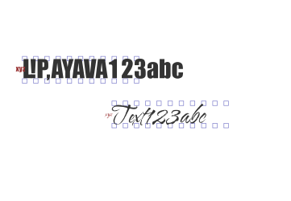

DRAW v0.2.20220430
==================

I started work on a package to create [Sudoku diagrams](https://github.com/nklein/sudoku-diagrams).
I know that sometimes I want them in a printable version and other times I want them
in a format that is easily displayed on the web.

This package attempts to distill the common parts of `CL-PDF`, `Vecto`, and maybe someday `CL-SVG`
into one interface where I can swap out the back-end to generate the type of file that I need
at a given time.

To render the Sudoku diagrams as PDFs, I used these functions from `CL-PDF`:
`bounds`, `circle`, `close-and-fill`,
`close-and-stroke`, `close-fill-and-stroke`, `draw-text`,
`get-char-size`, `get-font`, `get-font-descender`,
`get-kerning`, `in-text-mode`, `line-to`,
`move-text`, `move-to`, `rectangle`,
`set-font`, `set-line-width`, `set-rgb-fill`,
`set-rgb-stroke`, `translate`, `with-document`,
`with-page`, `with-saved-state`, `write-document`

With the exception of the `with-page` macro, these all seem very do-able
with `Vecto` (with some help from `ZPB-TTF`).
These are probably all very do-able in `CL-SVG`, as well, (though maybe not
with the font queries).
At the moment, I am torn about making this an almost drop-in replacement
(different package but same function names) for `CL-PDF`.
Some of the names above though are awkward for something generic.
Calling `write-document` for `Vecto` seems a bit odd.

Below is a test image as rendered by the `Vecto` backend.
You can download the same image [rendered by the `CL-PDF` backend](./images/draw-test.pdf).

INCOMPATIBILITIES
-----------------

This section outlines the known difference in output between the PDF backend
and the Vecto backend beyond the fact that the PDF backend outputs multi-page
_vector_ graphics and Vecto outputs one _raster_ graphic per page.

### Kerning

When you load a True-Type Font into `CL-PDF`, it usually (always?) embeds the
font into the PDF.

I am not sure if there is something off in the way that:
* PDF renderers use this embeded font,
* `CL-PDF` puts the font into the PDF, or
* `CL-PDF` uses PDF operators to render text strings.

The PDF document (or maybe just any of the PDF renders on my laptop)
does not take advantage of the kerning information in the font.

This can be seen in the second page of sample images above.
The odd text there was chosen to hit some of the most dramatic kerning shifts.
If you compare the PDF version with the Vecto version, you will see that the
Vecto version has used the kerning information to allow it to slide some
characters closer together.

(I disagree with the font's choice to kern the exclamation point so
close to the capital L, but that's what the font says and that's how
it looks like when I use the font in an image editor.)

There is no mechanism with which to tell `Vecto` not to use kerning.
I mean, why wouldn't one use it? My best guess is an Adobe vendetta
against free fonts. I dunno.

EXTENSIONS FROM CL-PDF
----------------------

The API of `DRAW` is based upon that of `CL-PDF` so that in many cases you will be able
to simply swap `PDF:` (or `:PDF` in importing statements) with `DRAW:`
(or `:DRAW` in importing statements).

To facilitate compatibility between `CL-PDF` and `Vecto`, the `WITH-DOCUMENT` now takes
a `:WIDTH` and `:HEIGHT` argument.

Because `CL-PDF` supports multi-page documents and `Vecto` does not, you may like to
write files out between each page when using the `Vecto` backend and write out
the document at the end only when using the `CL-PDF` backend.
To support this, `DRAW` provides the functions `SUPPORTS-MULTIPAGE-DOCUMENTS`
and `PAGE-NUMBERED-FILENAME`.

    (supports-multipage-documents) => t or nil
    (page-numbered-filename base-filename &optional (digits 1)) => filename-with-zero-padded-pagenumber

For example:

    (setf draw:*page-number* 37)
    (page-numbered-filename #P"/tmp/draw.out") => #P"/tmp/draw37.out"
    (page-numbered-filename #P"/tmp/draw.out" 4) => #P"/tmp/draw0037.out"

If you were generating a bunch of pages you might call `WRITE-DOCUMENT`
after each `WITH-PAGE` giving it the `PAGE-NUMBERED-FILENAME` of your base output filename
when `SUPPORTS-MULTIPAGE-DOCUMENTS` returns `NIL`. And you would call
`WRITE-DOCUMENT` with your output filename when `SUPPORTS-MULTIPAGE-DOCUMENTS`
returns non-`NIL`. Something like:

    (with-document (:width width :height height)
      (with-page () ...render.page.1...)
      (unless (supports-multipage-documents)
        (write-document (page-numbered-filename output-filename))))

      (with-page () ...render.page.2...)
      (unless (supports-multipage-documents)
        (write-document (page-numbered-filename output-filename))))
      ...

      (when (supports-multipage-documents)
          (write-document output-filename)))

To help ensure one doesn't construct things that will render differently with
different backends, errors are raised if you try to piece things together in unexpected ways like:

* Use `WITH-RENDERER` inside another `WITH-RENDERER` scope,
* Use `WITH-DOCUMENT` inside another `WITH-DOCUMENT` scope,
* Use `WITH-PAGE` inside another `WITH-PAGE` scope,
* Use `WRITE-DOCUMENT` outside of a `WITH-DOCUMENT` scope,
* Perform `WITH-DOCUMENT` outside of a `WITH-RENDERER` scope,
* Perform `WITH-PAGE` outside of a `WITH-DOCUMENT` scope,
* Perform `LOAD-TTF-FONT` or `GET-FONT` outside of a `WITH-DOCUMENT` scope,
* Perform drawing or transform operations outside of a `WITH-PAGE` scope, and
* Perform do font and text operations (except `LOAD-TTF-FONT` and `GET-FONT`) outside of an `IN-TEXT-MODE` scope.

Currently, `DRAW` will let you do transformations like `TRANSLATE`, `ROTATE`, and `SCALE` in the middle
of creating a path. This results in undefined behavior and the PDF and Vecto backends differ on how
that is handled. In a future release, doing such things after starting a path but before closing it
may raise an error, as well.

BACKEND STATUS
--------------

| Method                  | PDF   | Vecto |
|-------------------------| :---: | :---: |
| `circle`                | ✓     | ✓     |
| `close-and-fill`        | ✓     | ✓     |
| `close-and-stroke`      | ✓     | ✓     |
| `close-fill-and-stroke` | ✓     | ✓     |
| `close-path`            | ✓     | ✓     |
| `draw-text`             | ✓     | ✓     |
| `get-char-size`         | ✓     | ✓     |
| `get-font`              | ✓     | ✓     |
| `get-font-descender`    | ✓     | ✓     |
| `get-kerning`           | ✓     | ✓     |
| `in-text-mode`          | ✓     | ✓     |
| `line-to`               | ✓     | ✓     |
| `load-ttf-font`         | ✓     | ✓     |
| `move-text`             | ✓     | ✓     |
| `move-to`               | ✓     | ✓     |
| `rectangle`             | ✓     | ✓     |
| `rotate`                | ✓     | ✓     |
| `scale`                 | ✓     | ✓     |
| `set-font`              | ✓     | ✓     |
| `set-line-width`        | ✓     | ✓     |
| `set-rgb-fill`          | ✓     | ✓     |
| `set-rgb-stroke`        | ✓     | ✓     |
| `translate`             | ✓     | ✓     |
| `with-document`         | ✓     | ✓     |
| `with-page`             | ✓     | ✓     |
| `with-saved-state`      | ✓     | ✓     |
| `write-document`        | ✓     | ✓     |

PDF BACKEND
-----------

The `DRAW-PDF` backend exports the `PDF-RENDERER` class which can be used like:

    (draw:with-renderer (draw-pdf:pdf-renderer)
      (draw:load-ttf-font font-name handle)
      (draw:with-document (:width width :height height)
        (draw:with-page ()
          ...)
        (draw:write-document output-filename)))

The PDF backend can take advantage of these keyword arguments passed to `WITH-DOCUMENT`:

    :author string
    :title string
    :subject string
    :keywords string

Additionally, if you provide `WITH-DOCUMENT` both `WIDTH` and `HEIGHT`, then in the
dynamic scope of the document, the default page size is `WIDTH` and `HEIGHT`.

You can override the page boundary using the keyword `:BOUNDS` to the `WITH-PAGE` macro
and giving it a vector. However, if you do this, you will lose compatibility with the
`VECTO` backend which cannot change page sizes within a document. The most portable
option is to use the `WIDTH` and `HEIGHT` keywords for `WITH-DOCUMENT`.

VECTO BACKEND
-------------

The `DRAW-VECTO` backend exports the `VECTO-RENDERER` class which can be used like:

    (draw:with-renderer (draw-vecto:vecto-renderer :dpi 150 :page-color '(1.0 1.0 1.0 1.0))
      (draw:load-ttf-font font-name handle)
      (draw:with-document (:width width :height height)
        (draw:with-page ()
          ...)
        (draw:save-png output-filename)))

The `WITH-RENDERER` can take the following arguments:

    :dpi number
    :page-color list

The `DPI` is the number of dots per inch. This specifies how many pixels there are in
every inch (every 72-points) of document page.

The `PAGE-COLOR` is a list of either three or four numbers between 0 and 1. They are
used to set the background color for each page. If you wish the image to be transparent,
you can specify a zero four the fourth element of that list.

The Vecto backend can take advantage of these keyword arguments passed to `WITH-DOCUMENT`:

    :width number
    :height number

The `WIDTH` and `HEIGHT` are expected to be in points. The `DPI` is used to determine
the pixel width and height to use for the output image.

MAXIMIZING COMMON CODE FOR YOUR DRAWING
---------------------------------------

At the moment, if you wanted to render with either `CL-PDF` or `VECTO` you could write
almost all of your document in one place something like this:

    (defun common-parts (output-filename width height)
      (draw:with-document (:width width :height height ...)
        (draw:load-ttf-font #P"/some/dir/myfont.ttf" "myfont")
        (draw:with-page ()
          (draw:in-text-mode
            (draw:set-font (draw:get-font "myfont"))
            (draw:text "My Common Document"))
          ...)
        (draw:write-document output-filename)))

Then, you can write short functions to render with `CL-PDF` or `VECTO`:

    (defun render-with-draw-pdf (output-filename width height)
      (draw:with-renderer (draw-pdf:pdf-renderer)
        (common-parts output-filename width height)))

    (defun render-with-draw-vecto (output-filename width height dpi)
      (draw:with-renderer (draw-vecto:vecto-renderer :dpi dpi)
        (common-parts output-filename width height)))
